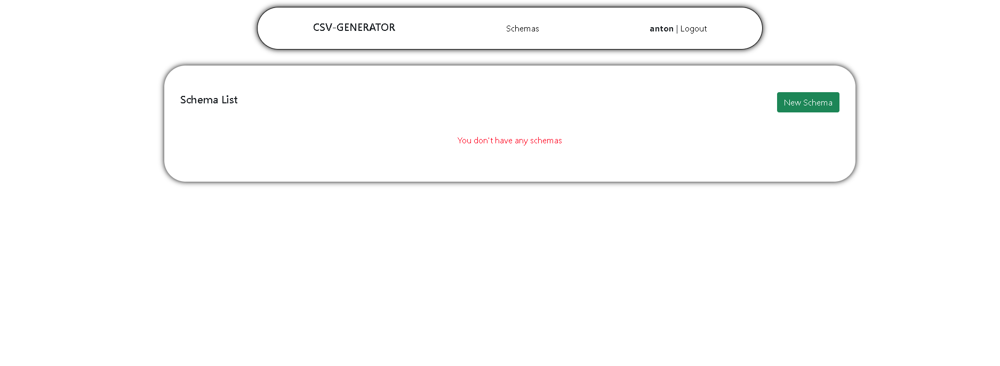
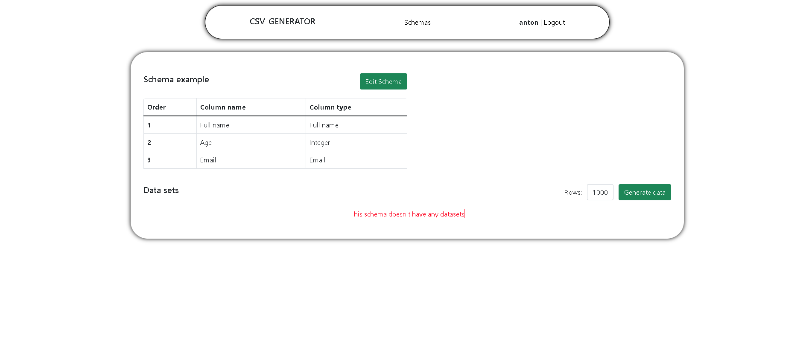

# CSV Generator Service


## Navigation
- [About project](#about-project)
- [Technologies](#technologies)
- [Installation](#installation)
- [Example](#example)
<hr>

## About Project
 Schema CSV Generator is a tool that provides users with the ability to easily create CSV files with fake data based on their schemas. Users can define a schema with an unlimited number of columns, set pre-built data types, order, and additional information for each column if necessary for the selected type.
<hr>

## Technologies
- [Django](https://docs.djangoproject.com/)
- [Docker](https://www.docker.com/)
- [Redis](https://redis.io/)
- [PostgreSQL](https://www.postgresql.org/)
- [Celery](https://docs.celeryq.dev/en/stable/)
- [AJAX](https://www.w3schools.com/xml/ajax_intro.asp)

## Installation

```shell
    1) git clone https://github.com/AntonShpakovych/planeks-csv-generator.git
    2) cd into project root
    3) create a .env file based on .env.sample
    4) docker compose up --build
    5) http://127.0.0.1:8000/
```
<hr>

## Example
Let's imagine that a user needs to generate a file for a school with `full_name`, `age`, `email` of a students.

1) Unfortunately, this is the user's first experience with the csv service, so he needs to create an account, but this can be done quickly through Google authorization.


2) The client successfully logged in to the service via Google.<br><br><br>


3) The client decides to create the scheme we talked about earlier.<br><br><br>


4) After successful creation of the schema, the client is transferred to all his schemas, from where he can proceed to file generation.<br><br><br>


5) After that, the user clicked on the `CSV` button and went to the file generation page.<br><br><br>


6) He decided that he needed 1000 records in the file and clicked the `Generate data` button.<br><br><br>


7) After a few seconds, the service generated the file and allowed the client to download it.<br><br><br>


8) This is the file the client got.<br><br><br>

